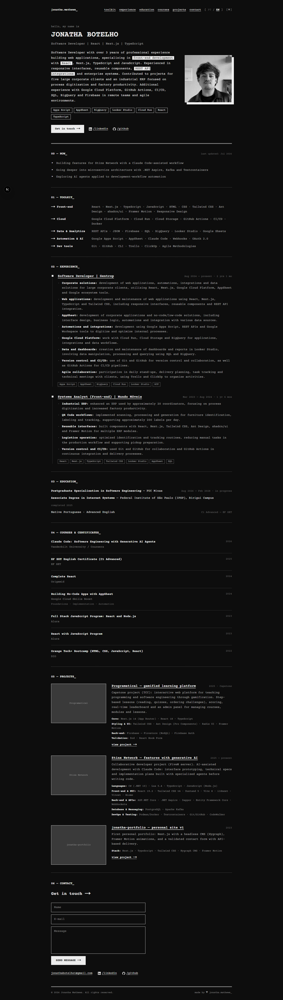
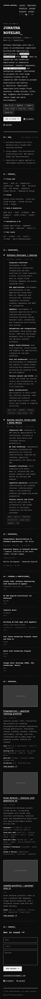

# Jonatha Botelho — Portfolio

Personal portfolio and interactive resume showcasing my experience, education,
courses, technical skills, and projects as a software developer. The interface
combines a terminal-inspired visual identity with a responsive, accessible
single-page experience.

## Highlights

- Content available in English and Portuguese
- Responsive layout for desktop and mobile devices
- Light and dark themes with persisted preferences
- Sections for experience, education, courses, projects, and contact
- Content integration with an external CMS and a versioned local fallback
- Contact form with validation and email delivery
- Automated unit and end-to-end tests

## Built with

Next.js, React, TypeScript, Tailwind CSS, next-intl, Zustand, Zod, Resend,
Vitest, and Playwright.

## Running locally

```bash
pnpm install
pnpm dev
```

Open [http://localhost:3000](http://localhost:3000) in your browser. The local
fallback content allows the portfolio to run without configuring a CMS.

## Screenshots

### Desktop



### Mobile


