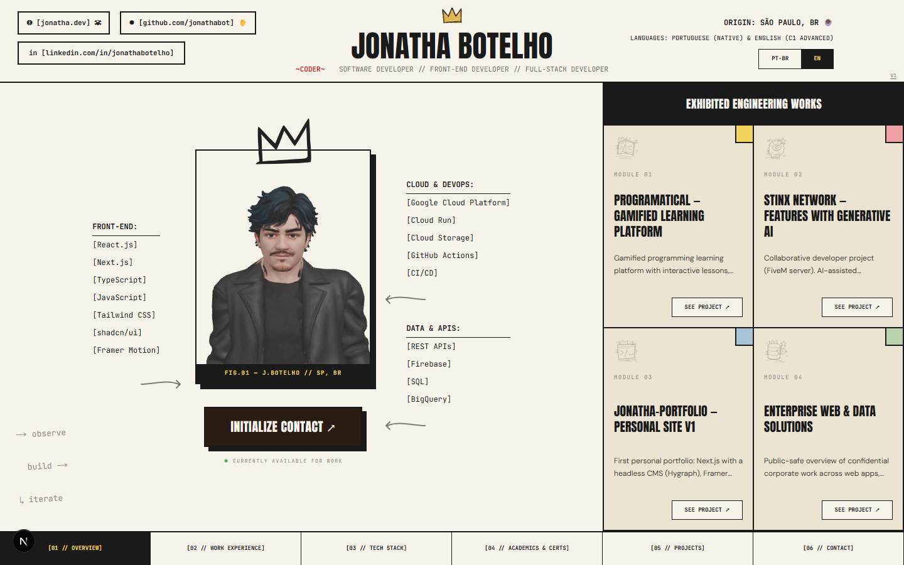

# Jonatha Botelho — Portfolio V2

Jonatha Botelho's personal portfolio and interactive resume. The interface
follows an editorial direction inspired by technical specification sheets,
engineering documentation, and hand-drawn annotations, with dedicated pages
for work experience, technical skills, education, projects, contact, and the
3D character study.

## Features

- Content available in Portuguese and English
- Responsive layouts for mobile, tablet, and desktop
- Route-based navigation with screen transitions
- Interactive GLB/WebGL 3D character
- Individual project pages
- Contact form validated with Zod
- Optional CMS integration with a versioned local fallback
- Unit tests with Vitest and end-to-end tests with Playwright

## Preview



## Technology stack

- Next.js 16 and React 19
- TypeScript
- Tailwind CSS 4
- next-intl
- Zustand
- React Three Fiber and Drei
- Framer Motion
- Zod and React Hook Form
- Resend
- Vitest and Playwright

## Running locally

Requirements: Node.js 20+ and pnpm.

```bash
pnpm install
pnpm dev
```

Open [http://localhost:3000](http://localhost:3000). The project works without
a configured CMS because it automatically uses the local content fallback.

## Local content

The portfolio's structured content is stored in
[`content/fallback.json`](./content/fallback.json). It contains Portuguese and
English versions of all visible site content, including:

- introduction and personal links;
- work experience;
- technical skills and tools;
- projects;
- education, courses, and certificates;
- contact form messages;
- navigation, labels, annotations, accessibility text, and page metadata;
- character-study and project-detail content.

Translatable fields follow this format:

```json
{
  "pt": "Texto em português",
  "en": "Text in English"
}
```

The file is validated with Zod through
[`lib/cms/schema.ts`](./lib/cms/schema.ts). Changes that do not match the schema
cause a validation error, preventing incomplete content from reaching the UI.

The V2 interface reads its content from this validated contract, so the same
file can be used as the source model for the future CMS response.

## CMS integration

Define the following variables in `.env.local` to load content from an external
endpoint:

```bash
CMS_ENDPOINT_URL=https://example.com/api/portfolio
CMS_TOKEN=optional-access-token
```

`CMS_TOKEN` is optional. When provided, it is sent to the endpoint through the
`token` query parameter.

Content loading follows this flow:

1. Without `CMS_ENDPOINT_URL`, the project uses `content/fallback.json`.
2. With an endpoint configured, the server requests the external JSON payload.
3. The response is validated with the same Zod schema as the local fallback.
4. If the request, timeout, or validation fails, the local fallback is used.

The endpoint must return an object compatible with the complete schema defined
in [`lib/cms/schema.ts`](./lib/cms/schema.ts).

## Commands

```bash
pnpm dev       # Start the development server
pnpm build     # Create a production build
pnpm start     # Start the production build
pnpm lint      # Run static analysis
pnpm test      # Run unit tests
pnpm test:e2e  # Run end-to-end tests
pnpm format    # Format files with Prettier
```

## Project structure

```text
app/                    Routes, layout, and contact API
components/v2/          Main Portfolio V2 interface
components/three/       3D character and viewer
content/fallback.json   Local content and CMS fallback
lib/cms/                Content schema, fetching, and transformation
public/                 GLB model, images, and public assets
e2e/                    Playwright tests
__tests__/              Vitest unit tests
```

## Validation before publishing

```bash
pnpm lint
pnpm test
pnpm test:e2e
pnpm build
```
